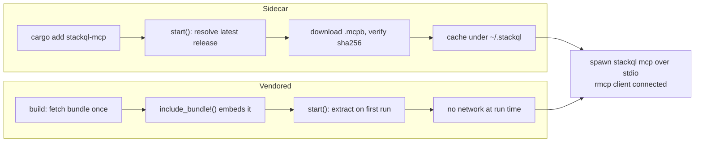
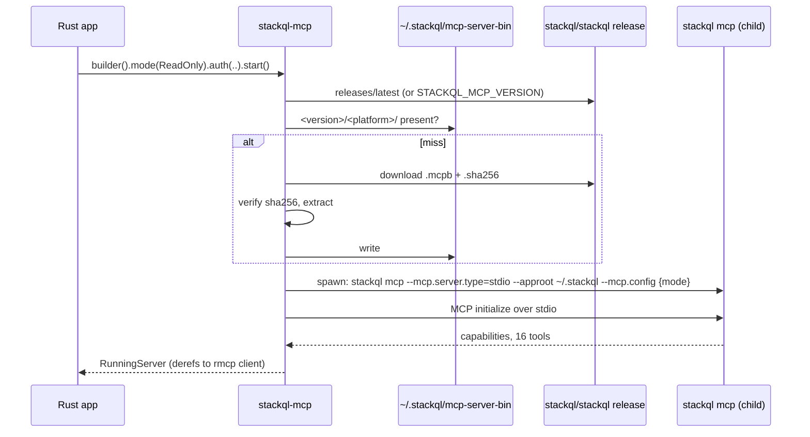
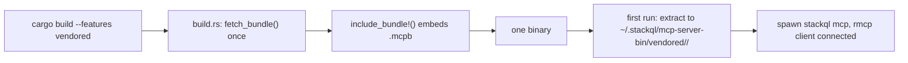

# Slide notes

Paste-ready text and mermaid source for the deck (Google Slides, link in CLAUDE.md). The deck's diagrams are mermaid renders; keep the same look (default theme, left-to-right, short node labels). Speaker notes are the things to say, not slide text. Slide order follows the deck.

Timing for a 45 minute slot including demo: title to "How to use StackQL" 4 min, act 1 demo 7, "Agentic platform ops" section 5, act 2 demo 4, "StackQL MCP" section 4, "Embedded MCP with Rust" section 6, act 3 demo 13, close 2.

## Existing slides: small corrections

"STACKQL MCP TOOL SURFACE": the current server (v0.10.601) publishes 16 tools. Update the lists:

- Discovery: `server_info`, `list_registry`, `pull_provider`, `list_providers`, `list_services`, `list_resources`, `list_methods`, `describe_resource`, `describe_method`, `query_library_search`, `query_library_get`, `reload_credentials`
- Query (reads): `run_select_query`, `validate_select_query`
- Change (writes): `run_mutation_query`, `run_lifecycle_operation`

Keep the mode line. Change "safe & delete_safe (uses elicitation)" to "safe and delete_safe ask the client for approval before each gated write (MCP elicitation); a client that cannot answer gets a refusal".

Speaker note for the modes line: the mode is a server-side contract. In `read_only` a mutation is refused however the model was prompted. In `safe` the server sends an `elicitation/create` request carrying the SQL and waits for the human. You will see this in the demo as a `[approval] allow this write? [y/N]` prompt.

## Slide: SIDECAR VS VENDORED (replaces "NEED A SLIDE ON SIDECAR VS VENDORED")

Title: Sidecar vs vendored

Subtitle: Two ways to acquire the server. One builder API. Chosen at build time.

Table:

| | Sidecar (default feature) | Vendored (`vendored` feature) |
|---|---|---|
| How the server arrives | resolved from the latest `stackql/stackql` release at start-up, `.mcpb` downloaded on first use | fetched once at build time, `include_bundle!()` compiles it in |
| Integrity | sha256 vs the release's `.sha256` asset (or pins baked into the crate) | the bytes are the artefact |
| First run | download, verify, extract, cache under `~/.stackql/mcp-server-bin/` | extract from the binary, cache, launch |
| Network at run time | first run of each release only | never |
| Artefact size | the app | app + ~40 MB (linux, windows), ~90 MB (macOS universal) |
| Choose when | small binaries, easy server updates | air-gapped hosts, one-file distribution, conference wifi |

Mermaid (two lanes, same endpoint):



Speaker note: same `StackqlMcp::builder()`, same `RunningServer` with a connected rmcp client. Sidecar keeps the app small and follows the latest server release. Vendored trades size for a single file that starts on a plane. The demo agent is built both ways; the vendored one is the reveal at the end.

## Slide: SIDECAR DETAILED

Title: Sidecar, in detail

Left: the code (this is `embedded/minimal/src/main.rs` minus the printing).

```toml
[dependencies]
stackql-mcp = "0.2"      # sidecar is the default feature
tokio = { version = "1", features = ["macros", "rt-multi-thread"] }
serde_json = "1"
```

```rust
use stackql_mcp::{Mode, StackqlMcp};

#[tokio::main]
async fn main() -> anyhow::Result<()> {
    let server = StackqlMcp::builder()
        .mode(Mode::ReadOnly)                                    // writes refused server-side
        .auth(serde_json::json!({ "github": { "type": "null_auth" } })) // no credentials
        .start()                                                 // acquire, verify, spawn, handshake
        .await?;                                                 // -> connected rmcp client
    let tools = server.list_all_tools().await?;                 // 16 StackQL tools
    server.shutdown().await?;
    Ok(())
}
```

Right: what `start()` does, as a sequence.



Bullets under the diagram:

- Env overrides: `STACKQL_MCP_BIN` (run a stackql you already have), `STACKQL_MCP_BUNDLE` (extract a local `.mcpb`), `STACKQL_MCP_VERSION=latest|pinned|<version>`
- Bring your own MCP stack: `Builder::command()` returns the acquired binary as a `std::process::Command` with the canonical arguments; spawn and serve it yourself (the demo agent does this to answer approval prompts)
- The cache is shared with the npm and PyPI wrappers

Speaker note: `start()` is the whole acquisition state machine and it logs each step to stderr, so on a first run the room sees the download and the verification. On the demo machine it is prewarmed; I will run one in the spare tab against a release that is not cached yet if there is time.

## Slide: VENDORED DETAILED

Title: Vendored, in detail

Left: the diff.

```toml
[dependencies]
stackql-mcp = { version = "0.2", features = ["vendored"] }

[build-dependencies]
stackql-mcp = { version = "0.2", features = ["sidecar"] }   # build.rs fetches the bundle
```

```rust
// build.rs: fetch once at build time, hand the path to include_bundle!()
fn main() {
    let path = stackql_mcp::fetch_bundle().unwrap();
    println!("cargo:rustc-env=STACKQL_MCP_BUNDLE_FILE={}", path.display());
}
```

```rust
let server = StackqlMcp::builder()
    .mode(Mode::ReadOnly)
    .auth(serde_json::json!({ "github": { "type": "null_auth" } }))
    .bundle_bytes(stackql_mcp::include_bundle!())   // <- the only change
    .start()
    .await?;
```

Right: sizes from an actual build (fill in from `ls -lh` after `scripts/prewarm.sh` on the demo machine; on Windows the debug build measured 12 MB for `minimal` and 51 MB for `minimal-vendored`, release builds are smaller for the app part and the darwin-universal bundle is larger at ~90 MB).



Bullets:

- Build time needs the network once (or `STACKQL_MCP_BUNDLE_FILE=/path/to.mcpb` to embed a bundle you already have)
- Run time never does: `HOME=$(mktemp -d) ./minimal-vendored` starts the server on a clean home directory
- Same builder, same client, same safety modes

Speaker note: this is a Rust-shaped artefact. `include_bytes!` is a language feature, not a packaging trick, so "an agent over your cloud estate as a single file" falls out naturally.

## Slide: DEMO

Title: Demo

Three lines, one per act, and the repo link / QR:

1. StackQL primer: shell, exec, srv. One engine, several front doors.
2. stackql-deploy, Rust native: a repo's golden path as data; build, test, teardown.
3. Embedded MCP: `minimal` (sidecar) -> `minimal-vendored` -> `steward check` / `steward fix` with human approval on every write -> the single binary.

Repo: github.com/stackql/rust-embedded-mcp-with-stackql (QR of the same)

Speaker note for the arc of act 3: start with the smallest program and the refused write (safety), then the one-line vendored change (distribution), then the agent doing platform-engineering work on real state (the point), then pull the network and show the same binary start (the reveal). The emotional beat is the `[approval]` prompt: the model proposes, the server asks, the human decides, and the SQL is on screen the whole time.

## Slide: THE ASK (optional, before the thank-you slide)

Title: What to do tonight

- `cargo add stackql-mcp` (docs.rs/stackql-mcp)
- Star github.com/stackql/stackql-mcp-rs and github.com/stackql/stackql
- Clone the demo repo, `steward check --repo your-org/your-repo`. Reads need zero credentials.
- Contribute: a policy for your golden path, a provider example (AWS, Google, Azure, Okta ...), a `stackql-deploy` stack, or an issue on the crate. Everything is MIT.

Speaker note: be specific about the ask; the room can act on "run it against your own org tonight, no credentials" before they forget.

## Recording

Record a full rehearsed run (act 1 to act 3) with asciinema or a screen recorder and put the link here before the talk:

- recording: (link)
